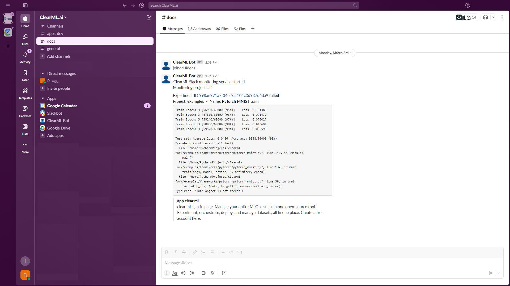

ClearML can be used to build bots that monitor tasks and send notifications based on specific events or conditions.

The base [`Monitor`](https://github.com/clearml/clearml/blob/master/clearml/automation/monitor.py) class provides 
the functionalities for implementing custom task monitoring logic.

The `Monitor` class can be extended to introduce custom bot logic. Developers can inherit from this class and override 
methods to introduce custom bot logic. For example, by overriding the `process_task` method, you 
can:
* Send notifications via Slack or other channels 
* Log task statuses to a database 
* Trigger automated responses when a task reaches a specific status

This is useful for:
* Real-Time Task Monitoring: Automate the tracking of task statuses 
* Custom Notification Logic: Implement specific filtering criteria based on task names, task projects, or other 
  criteria to receive relevant alerts.

## SlackBot for ClearML Task Monitoring

ClearML provides an example Slack bot built using [`clearml.automation.Monitor`](https://github.com/clearml/clearml/blob/master/clearml/automation/monitor.py). The bot does the following:

* Monitors task status (completion, failure, etc.).
* Sends notifications to a specified Slack channel.
* Retrieves task details such as status, console logs, and links to the ClearML Web UI.

You can configure filters for task types and projects to reduce unnecessary notifications.

For a full example and detailed setup, see the [Slack Alerts Example](../guides/services/slack_alerts.md).

