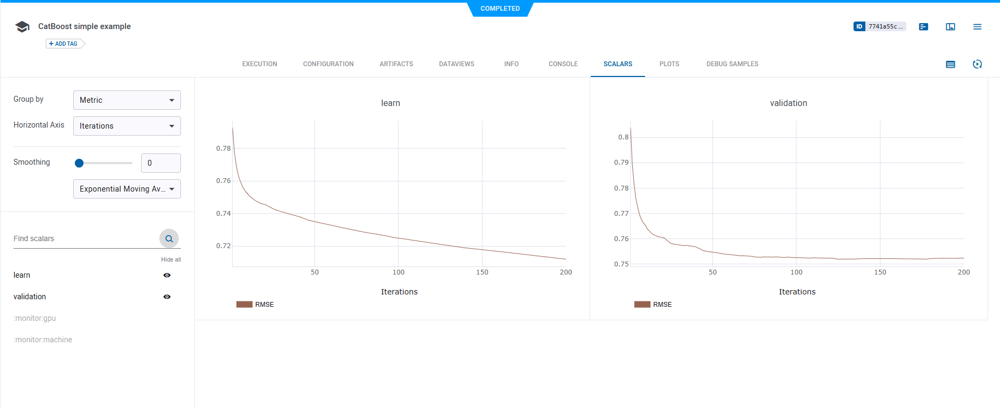
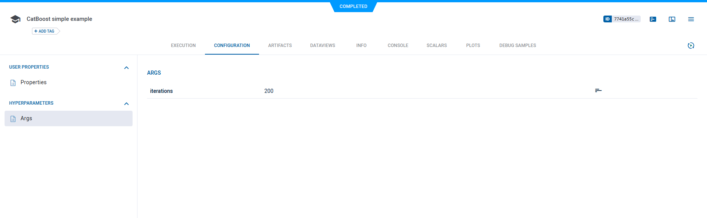
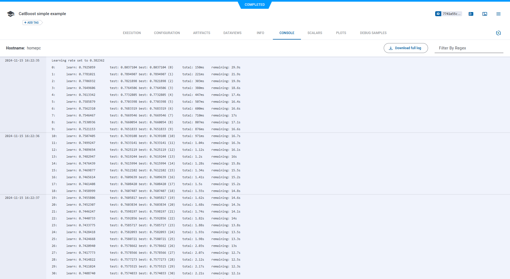
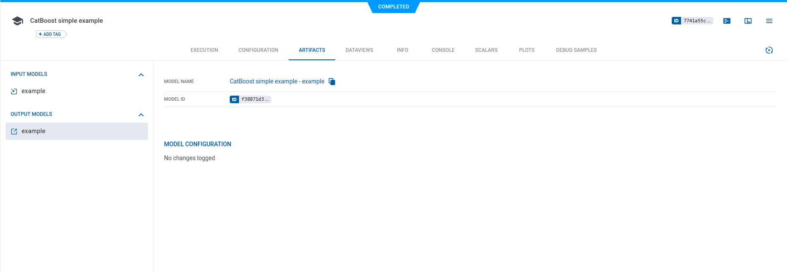
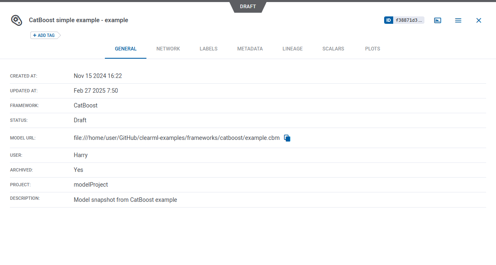

The [catboost_example.py](https://github.com/clearml/clearml/blob/master/examples/frameworks/catboost/catboost_example.py) 
example demonstrates the integration of ClearML into code that uses [CatBoost](https://catboost.ai).

The example script does the following:
* Trains a simple deep neural network on the CatBoost built-in [msrank](https://catboost.ai/en/docs/concepts/python-reference_datasets_msrank) 
  dataset.
* Creates a task named `CatBoost simple example` in the `examples` project
* ClearML automatically logs argparse command line options, and models and metrics logged by CatBoost

## Scalars
ClearML automatically captures scalars logged by CatBoost. These scalars can be visualized in plots, which appear in the 
[ClearML web UI](../../../webapp/webapp_overview.md), in the task's **SCALARS** tab.

## Hyperparameters
ClearML automatically logs command line options defined with argparse. They appear in **CONFIGURATIONS > HYPERPARAMETERS > Args**.

## Console
Text printed to the console for training progress, as well as all other console output, appear in **CONSOLE**.

## Artifacts
Models created by the task appear in the task's **ARTIFACTS** tab. ClearML automatically logs and tracks 
models created using CatBoost.

Clicking on the model name takes you to the [model's page](../../../webapp/webapp_model_viewing.md), where you can view 
the model's details and access the model.

