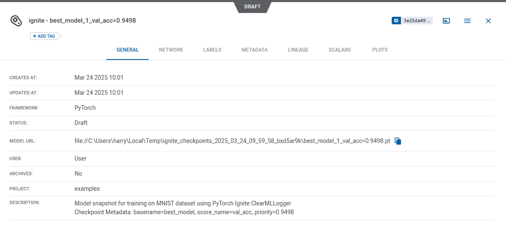

The `ignite` repository contains the [mnist_with_clearml_logger.py](https://github.com/pytorch/ignite/blob/master/examples/mnist/mnist_with_clearml_logger.py)
example script that uses [ignite](https://github.com/pytorch/ignite) and integrates **ClearMLLogger** and its [helper handlers](https://pytorch.org/ignite/v0.5.0.post2/generated/ignite.handlers.clearml_logger.html). 

PyTorch Ignite supports a `ClearMLLogger` handler to log metrics, text, model / optimizer parameters, plots, and model 
checkpoints during training and validation. 

The example script does the following:
* Trains a model to classify images from the MNIST dataset. 
* Creates a [ClearML Task](../../../fundamentals/task.md) named `ignite` in the `examples` 
  project. ClearMLLogger connects to ClearML so everything which is logged through it and its handlers 
  is automatically captured by ClearML. 
* Uses the following ClearMLLogger helper handlers:
    * **ClearMLSaver** - Saves input snapshots as ClearML artifacts.
    * **GradsHistHandler** and **WeightsHistHandler** - Logs the model's gradients and weights respectively as histograms.
    * **GradsScalarHandler** and **WeightsScalarHandler** - Logs gradients and weights respectively as scalars.

  
## ClearMLLogger

Integrate ClearML with the following steps:
1. Create a `ClearMLLogger` object. When the code runs, it connects to the ClearML backend, and creates a task in ClearML
   (see ClearMLLogger's parameters [below](#parameters)).

   ```python
   from ignite.contrib.handlers.clearml_logger import ClearMLLogger

   clearml_logger = ClearMLLogger(project_name="examples", task_name="ignite")
   ```

1. Attach helper handlers to the `ClearMLLogger` object.
   
   For example, attach the `OutputHandler` to log training loss at each iteration:
   ```python
   clearml_logger.attach(
     trainer,
     log_handler=OutputHandler(tag="training",
     output_transform=lambda loss: {"loss": loss}),
     event_name=Events.ITERATION_COMPLETED
   )
   ```

### Parameters
The following are the `ClearMLLogger` parameters:
* `project_name` - The name of the project in which the task will be created. 
* `task_name` – The name of task.
* `task_type` – The type of task (see [task types](../../../fundamentals/task.md#task-types)).
* `report_freq` – The histogram processing frequency (handles histogram values every X calls to the handler). Affects 
  `GradsHistHandler` and `WeightsHistHandler`. Default value is 100.
* `histogram_update_freq_multiplier` – The histogram report frequency (report first X histograms and once every X 
  reports afterwards). Default value is 10.
* `histogram_granularity` - Histogram sampling granularity. Default is 50.

### Logging 
To log scalars, ignite engine's output and/or metrics, use the `OutputHandler`. 

* Log training loss at each iteration:
```python
clearml_logger.attach(
    trainer,
    log_handler=OutputHandler(tag="training",
    output_transform=lambda loss: {"loss": loss}),
    event_name=Events.ITERATION_COMPLETED
)
```

* Log metrics for training:
    
```python
clearml_logger.attach(
    train_evaluator,
    log_handler=OutputHandler(
        tag="training",
        metric_names=["nll", "accuracy"],
        global_step_transform=global_step_from_engine(trainer)
    ),
    event_name=Events.EPOCH_COMPLETED
)
```

* Log metrics for validation:
                    
```python
clearml_logger.attach(
    evaluator,
    log_handler=OutputHandler(
        tag="validation",
        metric_names=["nll", "accuracy"],
        global_step_transform=global_step_from_engine(trainer)
    ),
    event_name=Events.EPOCH_COMPLETED
)
```

To log optimizer parameters, use the `attach_opt_params_handler` method:
```python
# Attach the logger to the trainer to log optimizer's parameters, e.g. learning rate at each iteration
clearml_logger.attach_opt_params_handler(
        trainer, event_name=Events.ITERATION_COMPLETED(every=100), optimizer=optimizer
)
```
 
### Model Weights

To log model weights as scalars, use `WeightsScalarHandler`:

```python
from ignite.contrib.handlers.clearml_logger import WeightsScalarHandler

clearml_logger.attach(
    trainer,
    log_handler=WeightsScalarHandler(model, reduction=torch.norm),
    event_name=Events.ITERATION_COMPLETED
)
```

To log model weights as histograms, use `WeightsHistHandler`:

```python
from ignite.contrib.handlers.clearml_logger import WeightsHistHandler

clearml_logger.attach(
    trainer,
    log_handler=WeightsHistHandler(model),
    event_name=Events.ITERATION_COMPLETED
)
```
    

### Model Snapshots

To save model checkpoints as ClearML artifacts, use `ClearMLSaver`:

```python
from ignite.handlers import Checkpoint
from ignite.contrib.handlers.clearml_logger import ClearMLSaver

handler = Checkpoint(
        {"model": model},
        ClearMLSaver(),
        n_saved=1,
        score_function=lambda e: e.state.metrics["accuracy"],
        score_name="val_acc",
        filename_prefix="best",
        global_step_transform=global_step_from_engine(trainer),
    )

validation_evaluator.add_event_handler(Events.EPOCH_COMPLETED, handler)
```


## Visualizing Task Results

When the code runs, the task results can be viewed in the [ClearML Web UI](../../../webapp/webapp_overview.md). 

### Scalars

View the scalars, including training and validation metrics, in the task's page in the ClearML Web UI, under 
**SCALARS**.


### Model Snapshots
 

View saved snapshots in the **ARTIFACTS** tab.


To view model details, in the **ARTIFACTS** tab, click the model name (or download it).


