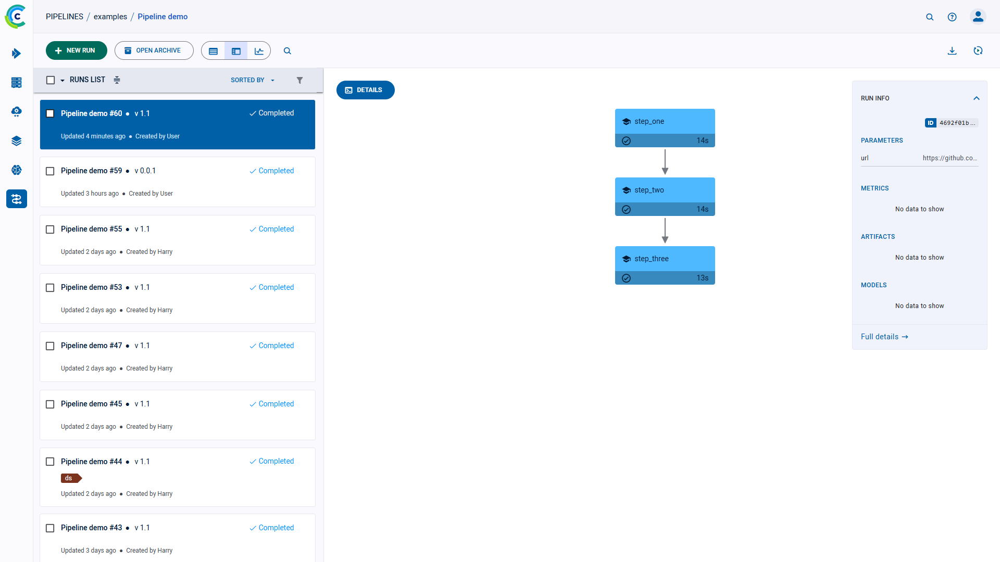

The [pipeline_from_functions.py](https://github.com/clearml/clearml/blob/master/examples/pipeline/pipeline_from_functions.py)
example script demonstrates the creation of a pipeline using the [PipelineController](../../references/sdk/automation_controller_pipelinecontroller.md) 
class.

This example creates a pipeline incorporating four tasks, three of which are created from a function:
* `step_one` - Downloads and processes data.
* `step_two` - Further processes the data from `step_one`.
* `step_three` - Uses the processed data from `step_two` to train a model.

The fourth task is the pipeline task, which is created when the pipeline is launched. 

The step functions will be registered as pipeline steps when they are added to the pipeline controller.

When the pipeline steps are executed, corresponding ClearML Tasks are created. Notice that all package imports inside 
the function will be automatically logged as required packages for the pipeline execution step.


## Pipeline Controller

1. Create the [PipelineController](../../references/sdk/automation_controller_pipelinecontroller.md) object:

   ```python
   pipe = PipelineController(
        name='pipeline demo',
        project='examples',
        version='0.0.1',
        add_pipeline_tags=False,
   )
   ```
    
1. Set an execution queue through which pipeline steps that did not explicitly specify an execution queue will be 
   executed. These pipeline steps will be enqueued for execution in this queue.
    
   ```python
   pipe.set_default_execution_queue('default')
   ```
   
1. Add a pipeline level parameter that can be referenced from any step in the pipeline (see `step_one` below).
   ```python
   pipe.add_parameter(
        name='url',
        description='url to pickle file',
        default='https://github.com/clearml/events/raw/master/odsc20-east/generic/iris_dataset.pkl'
   ) 
   ```
   
1. Build the pipeline (see [`PipelineController.add_function_step`](../../references/sdk/automation_controller_pipelinecontroller.md#add_function_step) 
   for complete reference).
   
   The first step in the pipeline uses the `step_one` function and uses as its input the pipeline level argument defined 
   above. Its return object will be stored as an artifact under the name `data_frame`.

   ```python
   pipe.add_function_step(
        name='step_one',
        function=step_one,
        function_kwargs=dict(pickle_data_url='${pipeline.url}'),
        function_return=['data_frame'],
        cache_executed_step=True,
   ) 
   ```
   
   The second step in the pipeline uses the `step_two` function and uses as its input the first step's output. This reference 
   implicitly defines the pipeline structure, making `step_one` the parent step of `step_two`. 
   
   Its return object will be stored as an artifact under the name `processed_data`.
 
   ```python
   pipe.add_function_step(
        name='step_two',
        # parents=['step_one'],  # the pipeline will automatically detect the dependencies based on the kwargs inputs
        function=step_two,
        function_kwargs=dict(data_frame='${step_one.data_frame}'),
        function_return=['processed_data'],
        cache_executed_step=True,
   )
   ```
   
   The third step in the pipeline uses the `step_three` function and uses as its input the second step's output. This 
   reference implicitly defines the pipeline structure, making `step_two` the parent step of `step_three`.
   
   Its return object will be stored as an artifact under the name `model`:
   
   ```python
   pipe.add_function_step(
        name='step_three',
        # parents=['step_two'],  # the pipeline will automatically detect the dependencies based on the kwargs inputs
        function=step_three,
        function_kwargs=dict(data='${step_two.processed_data}'),
        function_return=['model'],
        cache_executed_step=True,
    )
   ```
 
1. Run the pipeline: 
   ```python
   pipe.start()
   ```
   
   The pipeline will be launched remotely, through the `services` queue, unless otherwise specified.  
   
## WebApp
When the pipeline is executed, the console output displays the task ID, and links to the pipeline controller task page and pipeline page. 

```
ClearML Task: created new task id=bc93610688f242ecbbe70f413ff2cf5f
ClearML results page: https://app.clear.ml/projects/462f48dba7b441ffb34bddb783711da7/experiments/bc93610688f242ecbbe70f413ff2cf5f/output/log
ClearML pipeline page: https://app.clear.ml/pipelines/462f48dba7b441ffb34bddb783711da7/experiments/bc93610688f242ecbbe70f413ff2cf5f
```

The pipeline run's page contains the pipeline's structure, the execution status of every step, as well as the run's 
configuration parameters and output.



To view a run's complete information, click **Full details** on the bottom of the **Run Info** panel, which will open the 
pipeline's [controller task page](../../webapp/webapp_exp_track_visual.md).

Click a step to see an overview of its details.


## Console and Code

Click **DETAILS** to view a log of the pipeline controller's console output.   


Click on a step to view its console output. You can also view the selected step's code by clicking **CODE**
on top of the console log.


