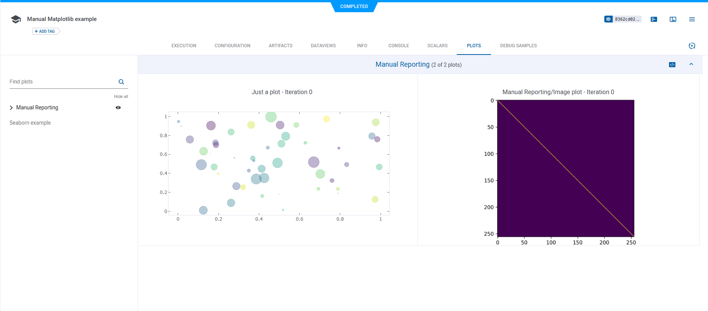
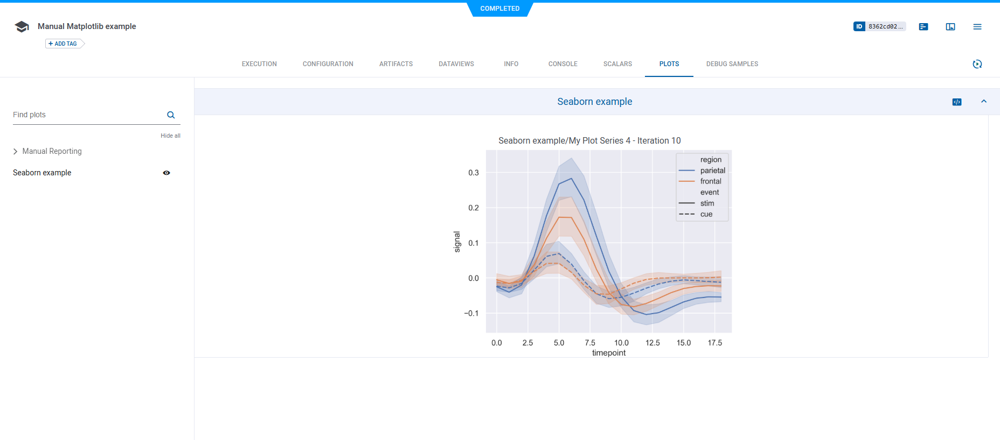
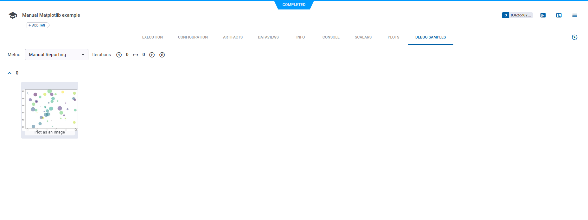

The [matplotlib_manual_reporting.py](https://github.com/clearml/clearml/blob/master/examples/reporting/matplotlib_manual_reporting.py) 
example demonstrates using ClearML to log plots and images generated by Matplotlib and Seaborn. 

## Plots

The Matplotlib and Seaborn plots reported using [`Logger.report_matplotlib_figure()`](../../references/sdk/logger.md#report_matplotlib_figure)
appear in the task's **PLOTS** tab.

## Debug Samples

Matplotlib figures can be logged as images by using [`Logger.report_matplotlib_figure()`](../../references/sdk/logger.md#report_matplotlib_figure), 
and passing `report_image=True`. The images are displayed in the task's **DEBUG SAMPLES**.

