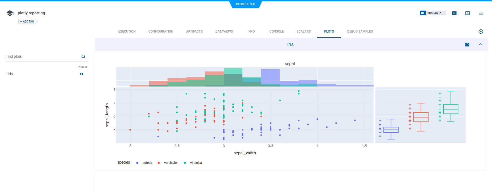

The [plotly_reporting.py](https://github.com/clearml/clearml/blob/master/examples/reporting/plotly_reporting.py) example 
demonstrates ClearML's Plotly integration and reporting. 

Report Plotly plots in ClearML by calling the [`Logger.report_plotly()`](../../references/sdk/logger.md#report_plotly) method, and passing a complex
Plotly figure, using the `figure` parameter. 

In this example, the Plotly figure is created using `plotly.express.scatter` (see the [Plotly documentation](https://plotly.com/python/line-and-scatter/)): 

```python
# Iris dataset
df = px.data.iris()
    
# create complex plotly figure
fig = px.scatter(
    df, 
    x="sepal_width", 
    y="sepal_length", 
    color="species", 
    marginal_y="rug", 
    marginal_x="histogram"
)
    
# report the plotly figure
task.get_logger().report_plotly(
    title="iris", series="sepal", iteration=0, figure=fig
)
```

When the script runs, it creates a task named `plotly reporting` in the examples project.

ClearML reports Plotly figures, and displays them in the **ClearML Web UI** **>** task's **PLOTS** 
tab.

