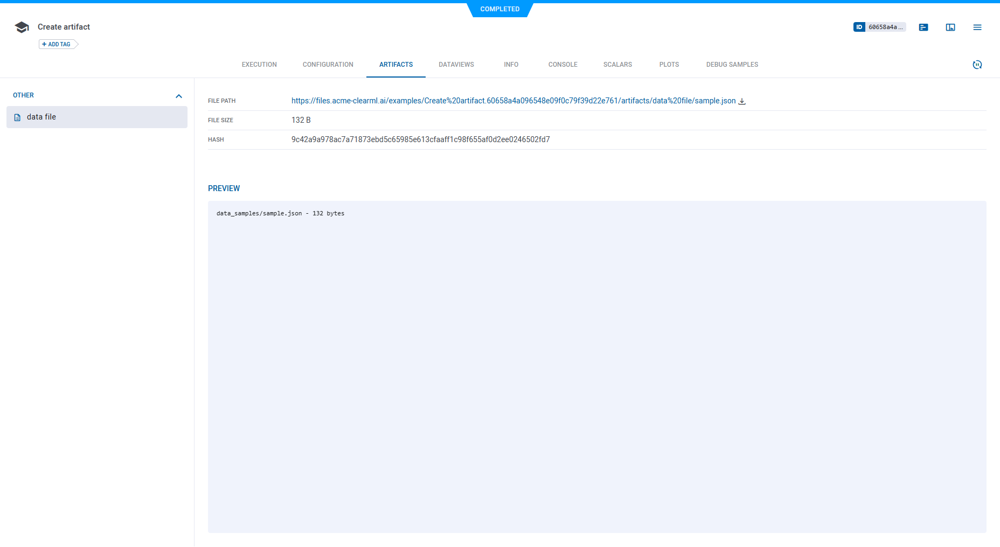

The [using_artifacts_example](https://github.com/clearml/clearml/blob/master/examples/reporting/using_artifacts_example.py) 
script demonstrates uploading a data file to a task as an artifact and then accessing and utilizing the artifact in a different task.

When the script runs it creates two tasks, `create artifact` and `use artifact from other task`, both of which are associated 
with the `examples` project. The first task creates and uploads the artifact, and the second task accesses the first task's 
artifact and utilizes it. 

## Task 1: Uploading an Artifact 

The first task uploads a data file as an artifact using [`Task.upload_artifact()`](../../references/sdk/task.md#upload_artifact), 
and inputting the artifact's name and the location of the file.

```python
task1.upload_artifact(name='data file', artifact_object='data_samples/sample.json')
```

The task is then closed, using [`Task.close()`](../../references/sdk/task.md#close), so another task can be 
initialized in the same script. 

Artifact details (location and size) can be viewed in ClearML's **web UI > task details > ARTIFACTS tab > OTHER section**. 



## Task 2: Accessing an Artifact

After the second task is initialized, the script uses the [`Task.get_task()`](../../references/sdk/task.md#taskget_task) 
class method to get the first task and access its artifacts, specifically the `data file` artifact. The `get_local_copy` 
method downloads the files and returns a path. 

:::info Cache
ClearML manages a cache of all downloaded content, so the code won't download the 
same data multiple times. See [Caching](../../integrations/storage.md#caching) for configuration options.
:::

```python
preprocess_task = Task.get_task(task_name='create artifact', project_name='examples')
local_json = preprocess_task.artifacts['data file'].get_local_copy()
```

Task 2 then reads the contents of the downloaded artifact and prints it to screen.


