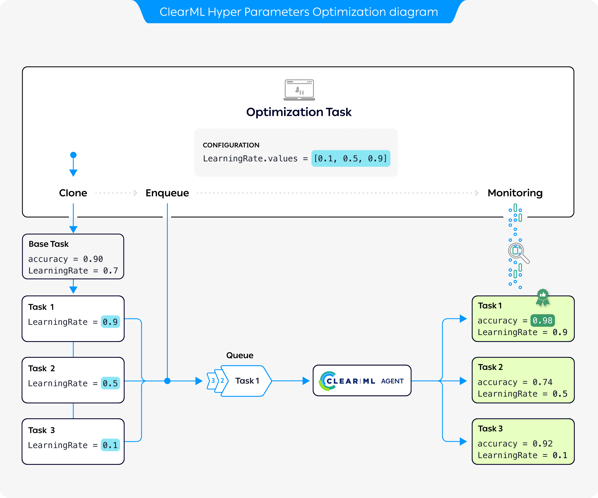

## What is Hyperparameter Optimization?
Hyperparameters are variables that directly control the behaviors of training algorithms, and have a significant effect on 
the performance of the resulting machine learning models. Hyperparameter optimization (HPO) is crucial for improving 
model performance and generalization.  

Finding the hyperparameter values that yield the best performing models can be complicated. Manually adjusting 
hyperparameters over the course of many training trials can be slow and tedious. Luckily, ClearML offers automated 
solutions to boost hyperparameter optimization efficiency.

## Workflow

The preceding diagram demonstrates the typical flow of hyperparameter optimization where the parameters of a base task are optimized: 

1. Configure an Optimization Task with a base task whose parameters will be optimized, optimization targets, and a set of parameter values to 
   test
1. Clone the base task. Each clone's parameter is overridden with a value from the optimization task  
1. Enqueue each clone for execution by a ClearML Agent
1. The Optimization Task records and monitors the cloned tasks' configuration and execution details, and returns a 
   summary of the optimization results. 

## ClearML Solutions 

ClearML offers three solutions for hyperparameter optimization:
* [GUI application](webapp/applications/apps_hpo.md): The Hyperparameter Optimization app allows you to run and manage the optimization tasks 
  directly from the web interface--no code necessary (available under the ClearML Pro plan).
* [Command-Line Interface (CLI)](apps/clearml_param_search.md): The `clearml-param-search` CLI tool enables you to configure and launch the optimization process from your terminal.
* [Python Interface](clearml_sdk/hpo_sdk.md): The `HyperParameterOptimizer` class within the ClearML SDK allows you to 
  configure and launch optimization tasks, and seamlessly integrate them in your existing model training tasks. 
