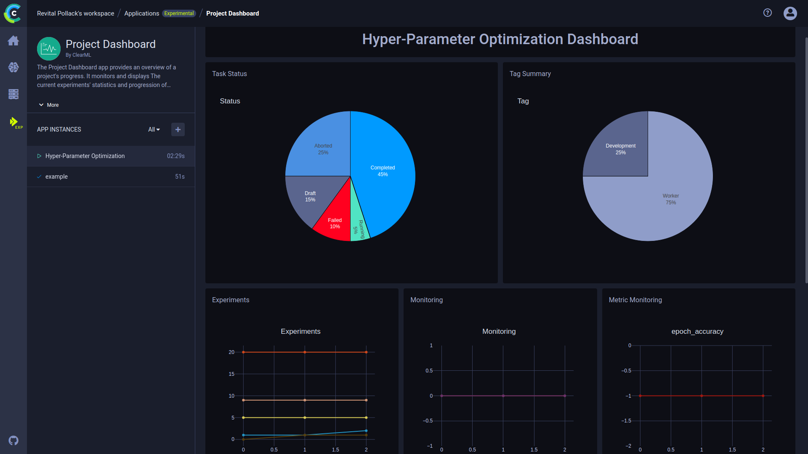

ClearML Applications are a new, experimental approach for extending ClearML's functionalities with no need to 
handle code. Input configurations into an application's wizard and then ClearML will launch an instance of the 
application and monitor its performance.

The applications include:
* [AWS Autoscaler](aws_auto_scaler) - Optimize AWS EC2 instance scaling according to the instance types and budget 
* [Hyperparameter Optimization](hyperparam_opt) - Find the parameter values that lead to the best performing models, 
  according to a configured metric objective and optimization strategy.
* [Nvidia Clara](nvidia_clara) - Easily configure and use Clara, Nvidia's framework for healthcare and life sciences 
  developers
* [Project Dashboard](project_dashboard) - Monitor a project's progress, a metric’s statistics, and GPU and worker usage. The app also supports Slack alerts about task failure 

## App Layout

When navigating to an application page, the page is split into two sections:
* **App Instances** list - on the left column of the app page. From there, navigate between app instances, create new 
  instances, and access [app actions](#app-actions). 
  
* Dashboard - the main section of the app page, to the right of the instance list. When an app instance is selected from 
  the **App Instances** list, the instance's details and results appear in the dashboard. 

## App Actions

Hover over an instance name on the **App Instances** list, and click the menu button 
 that appears in 
order to access app actions. 

|button|action|
|--|--|
| | Rename instance name |
| | See the instance's configurations |
| | Abort instance |
| | Clone instance |
|| Delete instance |

