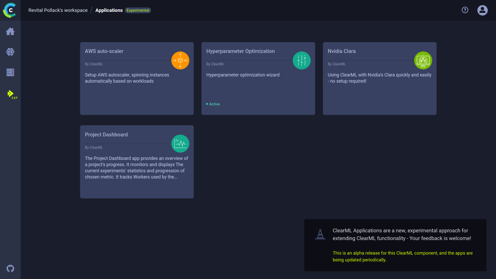

ClearML Applications are a new, experimental approach for extending ClearML functionalities where users don't have to 
handle code. Each application includes a wizard where configurations are input and then ClearML launches an instance of the 
application and monitors its performance.

The applications include:
* [AWS auto-scaler](aws_auto_scaler) - Optimize AWS EC2 instance scaling according to the instance types and budget configured 
* [Hyperparameter optimization](hyperparam_opt) - Perform optimization with ability to specify an optimization strategy, 
  targets, parameter values and ranges, and experiment and time limits
* [Nvidia Clara](nvidia_clara) - Create an instance of Clara, Nvidia's framework for healthcare and life sciences developers
* [Project Dashboard](project_dashboard) - Monitor a project's progress, a metric’s statistics, and GPU and worker usage. The app also supports Slack alerts for task failure. 
* [Cleanup Service](cleanup_app.md) - Delete old archived experiments after a specified period of time

## App layout

When navigating to an app page, the page is split into the left column and the main section of the app. 

In the left column of the app appears a list of all the **APP INSTANCES** that were launched. From there, new instances 
can be created and [app actions](#app-actions) can be accessed.

When an app instance is selected on the list on the left, the instance's results appear on the main section of the 
page. Once an app is launched, the page presents information about the instance, including
plots and console logs. 

## App actions

Hover over an app instance in the app page's left column, and click the menu button  
that appears in order to access app actions. 

|button|action|
|--|--|
| | See the instance's configurations |
| | Abort instance |
| | Clone instance |
|| Delete instance |

