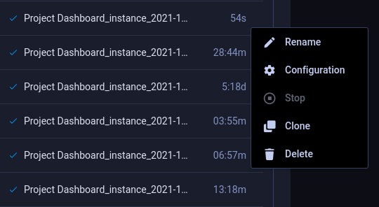

Manage ML workloads and automatically run your recurring workflows with ClearML’s GUI Applications–with no need to handle any code! 

Users can easily configure and launch app instances and then monitor instance performance from the app’s dashboard.

The applications include:
* [AWS Autoscaler](#aws-autoscaler) - Optimize AWS EC2 instance scaling according to a defined instance budget
* [Hyperparameter Optimization](#hyperparameter-optimization) - Find the parameter values that yield the best performing models.
* [Nvidia Clara](#nvidia-clara) - Easily configure and use Clara, Nvidia's framework for healthcare and life sciences developers
* [Project Dashboard](#project-dashboard) - Monitor a project's progress, and GPU and worker usage. The app also supports Slack alerts about task failure
* **Custom** - Create your own application! See full reference [here](applications.md)

## App Layout

Each application’s page is split into two sections:
* **App Instances** - The left column of the app page lists all instances. Click on an instance to view its dashboard and hover over it to access app actions.
* **Dashboard** - the main section of the app page, to the right of the instance list. When an app instance is selected from the App Instances list, its details and results appear in the dashboard.

## App Actions

Hover over an instance name on the **App Instances** list, and click the menu button  that appears in 
order to access app actions. 

## Launching an App Instance

1. Navigate to the relevant app
1. Click  on the top right of the instance list to open a configuration form
1. Input configurations 
1. Click **Launch**

## Apps 

### AWS Autoscaler
The AWS Autoscaler Application optimizes AWS EC2 instance scaling according to a defined instance budget. The autoscaler 
periodically polls your AWS cluster and automatically stops idle instances based on a defined maximum idle time or spins 
up new instances when there aren't enough to execute pending tasks. To launch the autoscaler, input your AWS and Git 
details, and operation configurations.

Once an application instance is launched, ClearML monitors the instance and provides information about the available 
instances and their status in the app dashboard.

### Hyperparameter Optimization
The Hyperparameter Optimization Application finds parameter values that yield the best performing models! 

When launched, the app clones and enqueues the `Initial Task to Optimize` multiple times, each time with different parameter 
values, as defined in `Parameters to Optimize`. The optimizer utilizes a specified optimization strategy (random, Bayesian, etc.), 
to approach the input `Optimization Objective`, to maximize or minimize a specific metric. 

Once launched, the app’s dashboard will display a summary of the optimization. 

### Nvidia Clara
Nvidia Clara is a framework for data annotation, training, and deployment for medical applications. Create an instance 
of Nvidia Clara quickly and painlessly--no setup required on your part! 

Use the application to specify training and environment configurations, and to input your dataset task. ClearML will 
do the rest of the work of creating and monitoring the instance.

### Project Dashboard
The Project Dashboard Application provides overviews of projects' progress. When creating an instance, input a project 
and a metric to monitor. Once the app instance is launched, its dashboard displays a general overview of the project, 
including:
* Experiment status summary
* An aggregated view of the values of a metric over the dashboard's iterations
* GPU usage
* Worker usage

The app also supports Slack alerts for task failure. All you need to do is insert your Slack API token and channel name.
