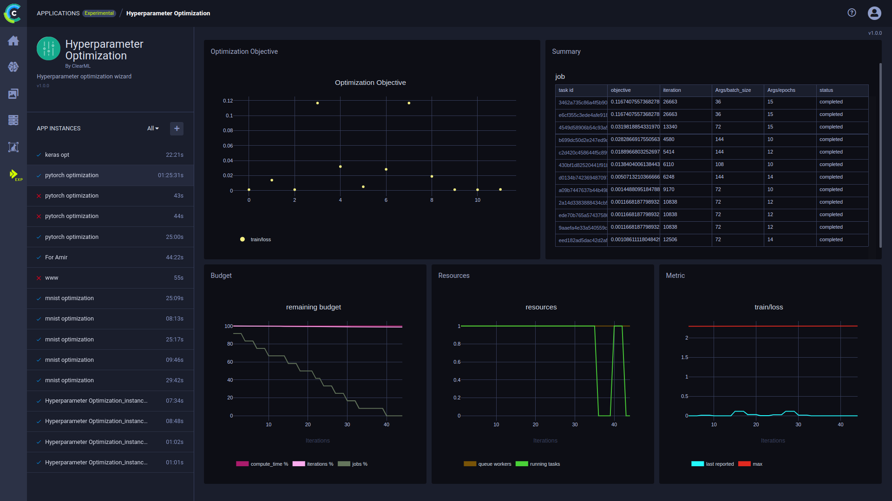

The Hyperparameter Optimization Application is a GUI for finding the parameters that create the best results in an experiment--without
handling any code! 

Use the app's wizard to specify an optimization strategy, targets, parameeter values and ranges, 
and experiment and time limits. Then the app does the rest: enqueueing clones of the base task with different parameter values, 
then monitoring the results in order to find the optimal parameter values.

## Launching a Hyperparameter Optimization App instance

To launch a Hyperparameter Optimization instance:
1. Navigate to the Hyperparameter Optimization App
1. Click 
1. Insert configurations:
    - **Name** - App instance name 
    - **Base Task ID** - ID of the task whose hyperparameters are going to be optimized
    - **Optimization Strategy** - Choose a strategy from the drop down menu (e.g. random, grid, Optuna)
    - **Concurrent Tasks** - Maximum number of concurrent tasks
    - **Title** - Title of metric to maximize / minimize
    - **Series** - Series of metric to maximize / minimize
    - **Sign** - Choose optimization goal, whether to maximize or minimize the metric value
    - **Queue** - Execution queue to enqueue tasks (make sure an agent/s is assigned to that queue) 
    - **Discrete Parameters** 
        - **Parameter** - Parameter name (include section name, e.g. `Args/lr`)
        - **Values** - List specific parameter values to try, separated by commas 
    - **Uniform Parameters**
        - **Parameter** - Parameter name (include section name, e.g. `Args/batch_size`)
        - **Minimum Value** - Minimum value of the parameter 
        - **Maximum Value** - Maximum value of the parameter
        - **Step Size** - Step size between parameter values
    - **Max Experiments** - Maximum number of experiments per parameter 
    - **Experiments to save** - Number of experiments to save. This number of experiments with the best results are saved, 
      the rest are archived
    - **Time Limit** - Time limit (in minutes) per experiment
    - **Min Iterations** - Minimum iterations per experiment
    - **Max iterations** - Maximum iterations per experiment 
    - **Max Optimization Time** - Time limit (in minutes) of whole optimization process 

### Plots
Once launched, a few plots will appear in the app:
* **Optimization Objective** -  Scatter plot presenting the values of the metric being maximized / minimized, over iteration number
* **Summary** - Tabular summary of the optimization results, which includes the metric and parameter values. 
* **Budget** - Remaining budget percentages for compute time, iterations, and jobs  
* **Resources** - Number of workers listening to the execution queue, and the number of running tasks over iteration number 
* **Metric** - Last reported and maximum / minimum values of metric being maximized / minimized, over iteration number

