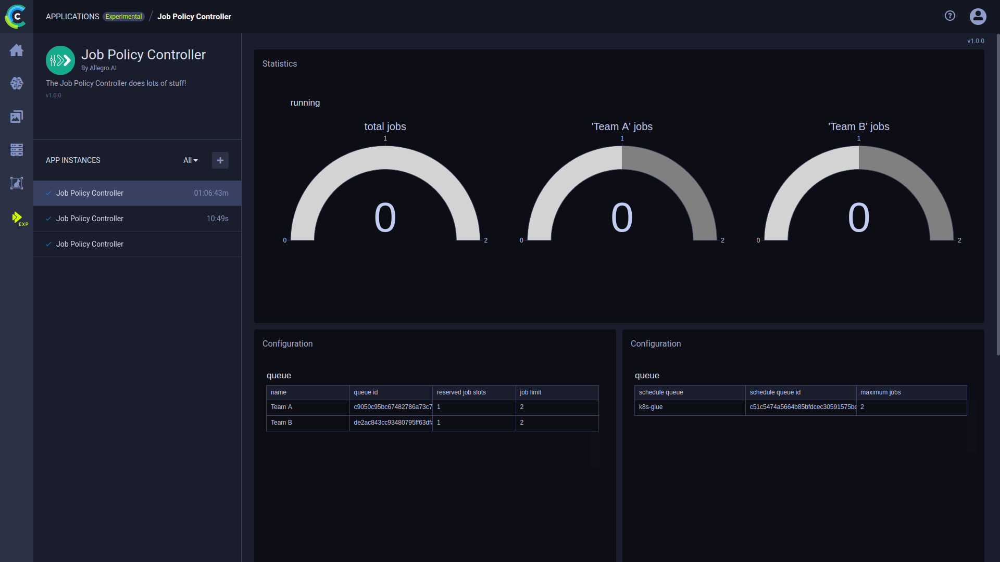

The Job Policy Controller Application is a GUI for defining and conducting job policies.

## Prerequisite
Before launching the app, connect a Kubernetes Cluster to a queue which will be used as the instance's **execution
queue**. 

## Launching a Job Policy Controller instance

**To launch a job policy controller instance:** 
1. Navigate to the Job Policy Controller App
1. Click 
1. Insert configurations:
    * **Name** - Name of app instance
    * **Execution queue** - K8s execution queue
    * **Maximum running jobs** - Total number of running jobs for this instance
    * **Monitored queues**
        * **Queue** - Queue to monitor
        * **Reserved jobs** - Number of jobs reserved for this queue
        * **Maximum jobs** - Maximum number of jobs for this queue
        * **+ Add item** - Configure another queue to monitor
   
## Plots

Once the app instance is launched a few plots will appear in the app's main area:
* ** Statistics** - Plot presenting the total number of jobs running / available, and the jobs running / available in each 
  monitored queue 
* **Configuration** tables
   * The first table presents the configurations of the monitored queues: their names, IDs, reserved jobs slots, and job limit
   * The second table presents the configurations of the execution queue: its name, ID, and maximum jobs

## Console    

Below the plots, there is a log with all the app's console outputs. 
