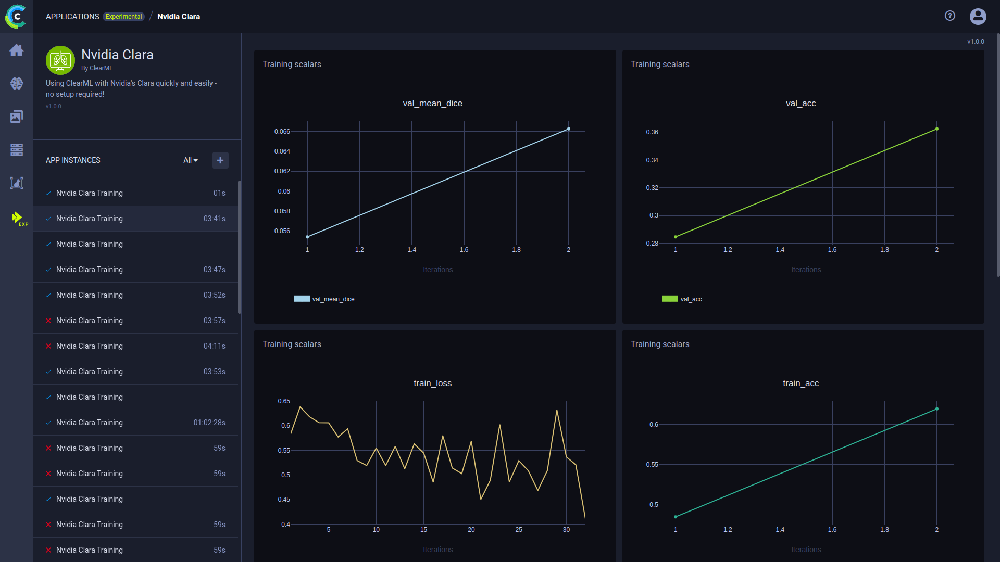

The Nvidia Clara Application is a GUI for creating an instance of Nvidia Clara quickly and painlessly--no setup required 
on your part! [Nvidia Clara](https://developer.nvidia.com/clara) is a framework for data annotation, training, and 
deployment for medical applications. Use the application to specify configurations, and ClearML will do the rest the of 
the work of creating and monitoring an instance.

## Launching an Nvidia Clara App Instance

To launch an Nvidia Clara instance:
1. Navigate to the Nvidia Clara App
1. Click 
1. Insert configurations:
    - **App Instance Name** - Name for the app instance
    - **Dataset Task** -  ID of the dataset task that contains the data to be used 
    - **Training Arch** - Choose training architecture with default configurations 
    - **Config File** - If training architecture isn't chosen above, there is also an option to input a configuration file
    If a training architecture was chosen, skip this configuration, since the training architecture includes default configurations 
    - **Environment File** - If you don't want to use the default environment file, input your own environment configurations  
    - **MMAR** - Medical Model Archive which defines a standard structure for organizing artifacts created during the model 
    development. It is the framework to configure and enable model training environment. See [MMAR](https://docs.nvidia.com/clara/clara-train-sdk/pt/mmar.html).
    - **Set** - Input keys=value pairs to override variables in one of the following files:
        * DATASET_JSON  - Configuration file with annotated data used for model training and validation
        * MMAR_CKPT_DIR  - Directory for saving training results. It is always the “models” folder in the MMAR
    - **Execution Queue** - Queue to enqueue app. Make sure that an agent/s is listening to the queue

    
## Plots

Once the app is launched, the following plots should appear in the dashboard:
* **Training scalars**
    * val_mean_dice
    * val_acc
    * train_loss
    * train_acc
* **Models Table** - Training model names and paths

## Console Log

The complete experiment log containing everything printed to stdout and strerr appears in the console log.
