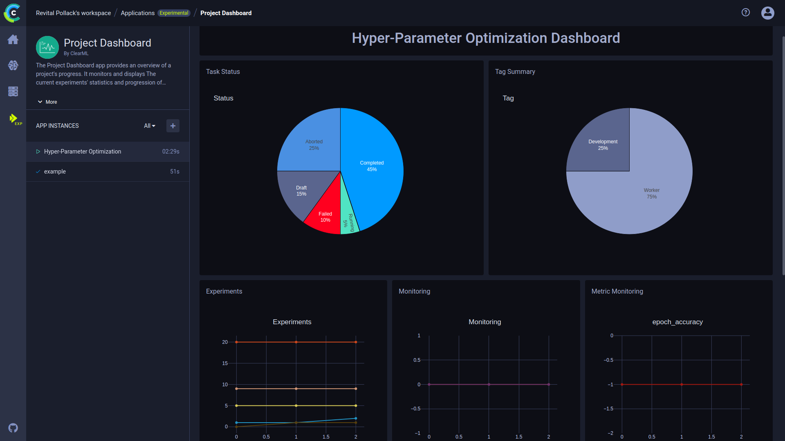

The Project Dashboard Application provides overviews of projects' progress. 
Once an app instance is launch, its dashboard presents useful information about a project, including:
* An aggregated view of the values of a metric over the dashboard's iterations
* GPU usage
* Worker usage
* Experiment status summary

In addition, the app supports Slack alerts for task failure.

 

## Launching Project Dashboard App Instance 

To launch a Project Dashboard instance:
1. Navigate to the Project Dashboard App
1. Click 
1. Insert configurations:
    * **Monitored Project Name** - Name of project on server to monitor
    * **Monitored Metric - Title** - Title of metric to track
    * **Monitored Metric - Series** - Metric series (variant) to track
    * **Monitored Metric - Trend** - Choose whether to track the monitored metric's highest or lowest values
    * **Dashboard Title** - Name of app instance, which will appear in the instance list
    * **Slack Integration API Token** - Token for Slack workspace for the purpose of sending alerts about task failure (optional)
    * **Slack Integration - Channel Name** - Slack channel to receive task failure alerts (optional) 
    * **Slack Integration - Report Iteration Threshold** - Minimum number of iterations to trigger Slack alerts about 
      task failure
* Click **Launch New**
   
## Plots 

Once the app is launched, a few plots appear in the app's dashboard: 
* **Task Status Summary** - Pie chart of the task statuses in the project
* **Task Type Summary** - Pie chart of the percentages of development experiments vs. agent experiments 
* **Experiments Summary** - Number of tasks per status over iteration number 
* **Monitoring** - GPU utilization and GPU memory usage
* **Metric Monitoring** - Values of the specified metric over iterations
* **Project's Active Workers** - Number active workers
* **Workers Table** - List of active workers
* **Failed Experiments** - Table of failed experiments and their time of failure